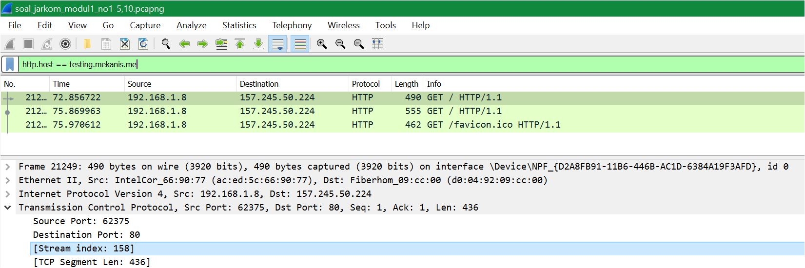
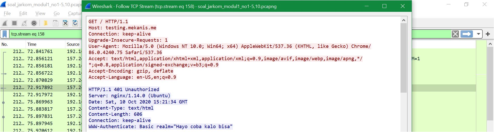
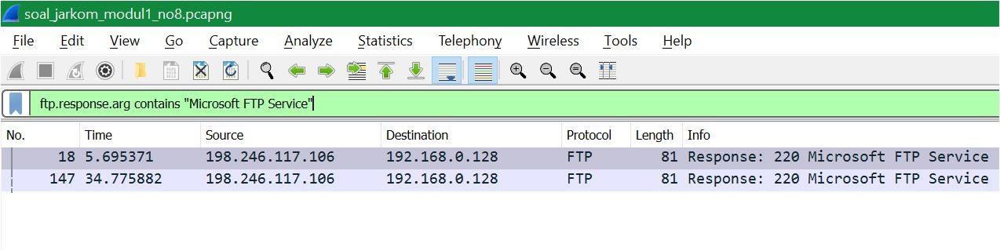
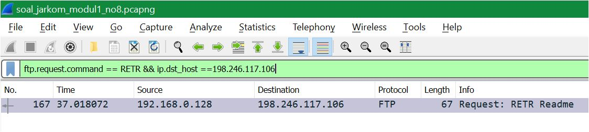

# Jarkom_Modul1_Lapres_A14
Laporan Resmi Modul 1 Praktikum Jaringan Komputer
#
- Rofita Siti Musdalifah    (05111840000034)
- Vachri Attala Putra       (05111840000043)
#
## Display Filter
1. [Soal1](#soal1)
2. [Soal2](#soal2)
3. [Soal3](#soal3)
4. [Soal4](#soal4)
5. [Soal5](#soal5)
6. [Soal6](#soal6)
7. [Soal7](#soal7)
8. [Soal8](#soal8)
9. [Soal9](#soal9)
10. [Soal10](#soal10)
## Capture Filter
11. [Soal11](#soal11)
12. [Soal12](#soal12)
13. [Soal13](#soal13)
14. [Soal14](#soal14)
15. [Soal15](#soal15)
#

### Soal1
1.	Sebutkan webserver yang digunakan pada "testing.mekanis.me"!
    -	Masukkan command ```http.host == testing.mekanis.me``` pada Display Fitur 
   
    

    -   Kemudian masuk ke TCP Stream dengan cara klik kanan pada paket lalu pilih Follow -> TCP Stream 
    -	Kemudian terlihat bahwa webserver yang digunakan adalah **nginx/1/14/0 (Ubuntu)**, dengan destination port 80 (HTTP)

    


#

### Soal2
2.	Simpan gambar "Tim_Kunjungan_Kerja_BAKN_DPR_RI_ke_Sukabumi141436.jpg"!
    -	Pilih File -> Export Objects -> HTTP
    -	Kemudian pada text filter dituliskan nama file **Tim_Kunjungan_Kerja_BAKN_DPR_RI_ke_Sukabumi141436.jpg**.
    -	Pilih file tersebut kemudian Save pada direktori yang diinginkan.


#

### Soal3
3.	Cari username dan password ketika login di "ppid.dpr.go.id"!
-	Menggunakan command filter: ```http.host == ppid.dpr.go.id && http.request.method == POST && http.request.uri contains login ```
-   Pada bagian HTML Form URL Encoded, bisa dilihat bahwa Username dan Passwordny adalah
    -	Username: **10pemuda**
    -	Password: **guncangdunia**


#

### Soal4
4.	Temukan paket dari web-web yang menggunakan basic authentication method!
-	Masukkan command ```http.authbasic``` pada Display Filter


#

### Soal5
5.	Ikuti perintah di aku.pengen.pw! Username dan password bisa didapatkan dari file .pcapng!
- Masukkan command ```http.host == aku.pengen.pw && http.authbasic``` pada Display Filter


- Pada salah satu paket, lihat pada bagian (Hypertext Transfer Protocol -> Authorization ->  Credential, username dan password:
    - Username: **kakakgamtenk**
    - Password: **hartatahtabermuda**
#

### Soal6
6.	Seseorang menyimpan file zip melalui FTP dengan nama "Answer.zip". Simpan dan Buka file "Open This.pdf" di Answer.zip. Untuk mendapatkan password zipnya, temukan dalam file zipkey.txt (passwordnya adalah isi dari file txt tersebut).
- Masukkan command ```ftp-data.command contains Answer.zip``` pada Display Filter untuk menemukan file zip Answer.zip


- untuk mendapatkan file zip Answer.zip klik kanan pada paket lalu pilih Follow -> TCP Stream, kemudian pilih tipe ```Raw``` kemudian Save As zip file
- Dikarenakan file zip tersebut bertipe password protected, maka kita harus mencari password itu yang tersimpan pada file **zipkey.txt**

- untuk mendapatkan passwordnya, masukkan command ```ftp-data.command contains zipkey.txt``` pada Display Filter
- kemudian klik kanan pada paket lalu pilih Follow -> TCP Stream, kemudian pilih tipe ```Raw``` kemudian Save As txt file


- didapat password hey997400323051 kemudian gunakan untuk membuka file "Open This.pdf" di Answer.zip


#

### Soal7
7.	Ada 500 file zip yang disimpan ke FTP Server dengan nama 1.zip, 2.zip, ..., 500.zip. Salah satunya berisi pdf yang berisi puisi. Simpan dan Buka file pdf tersebut.
Your Super Mega Ultra Rare Hint = nama pdf-nya "Yes.pdf"
-	masukkan command ```ftp-data contains Yes.pdf``` pada Display Filter untuk mencari file pdf yang diinginkan.


-	Kemudian klik kanan pada paket lalu pilih Follow -> TCP Stream, kemudian pilih tipe ```Raw``` kemudian Save As zip file
-	Kemudian dapat di-unzip dan muncul file **Yes.pdf**


#

### Soal8
8.	Cari objek apa saja yang didownload (RETR) dari koneksi FTP dengan Microsoft FTP Service!
-   Masukkan command ```ftp.request.command == RETR``` pada Display Filter


-   Untuk mencari koneksi dengan Microsoft FTP Service, maka kami cari terlebih dahulu IP nya dengan command ```ftp.response.arg contains "Microsoft FTP Service"```



-   Lalu dapat dilihat bahwa dari Response Microsoft FTP Service tersebut, IP nya adalah ```198.246.117.106```
-   Sehingga command untuk menambahkan filter koneksi FTP yg menggunakan Microsoft FTP Service pada command sebelumnya adalah sebagai berikut ```ftp.request.command == RETR && ip.dst_host ==198.246.117.106```



-	Sehingga dapat dilihat bahwa objek yang didownload dari koneksi FTP dengan Microsoft FTP Service berupa file **Readme** saja
#

### Soal9
9.	Cari username dan password ketika login FTP pada localhost!
-   Masukkan command ```ftp.request.command == PASS || ftp.request.command == USER``` pada Display Filter


-	Maka dapat dilihat langsung username dan password sebagai berikut:
    -   USER: **dhana**
    -	PASS: **dhana123**
#

### Soal10
10.	Cari file .pdf di wireshark lalu download dan buka file tersebut!
clue: "25 50 44 46" 
-	Karena Clue adalah berupa hex maka kami menggunakan fitur Find Packet wireshark 
    -   Klik shortcut ctrl+f
    -   Pilih filter ```Hex value```
    -   Masukkan clue ```25 50 44 46```.


-	Kemudian klik kanan pada paket lalu pilih Follow -> TCP Stream, kemudian pilih tipe ```Raw``` kemudian Save As pdf file
-	Setelah dibuka ternyata file tersebut berupa UU RI berikut


#

### Soal11
11.	Filter sehingga wireshark hanya mengambil paket yang mengandung port 21!
-	Capture Filter command: ```port 21```.


- Sehingga didapat paket-paket sebagai berikut


#

### Soal12
12.	Filter sehingga wireshark hanya mengambil paket yang berasal dari port 80!
-	Capture Filter command: ```src port 80```.


-   Untuk membuktikan maka kami membuka web http://monta.if.its.ac.id/ dimana ia berupa HTTP (port 80)


#

### Soal13
13.	Filter sehingga wireshark hanya menampilkan paket yang menuju port 443!
-	Capture Filter command: ```dst port 443```


-   Untuk membuktikan maka kami membuka mengakses https://www.google.com dimana ia berupa HTTPS (port 443)


#

### Soal14
14.	Filter sehingga wireshark hanya mengambil paket yang berasal dari ip kalian!
-	Pertama kami mencari ip dengan menggunakan command prompt, kemudian memasukkan command ```ipconfig```


-	Sehingga untuk mengambil paket yang berasal dari ip kami, kami memasukkan pada capture filter command ```ip src 192.168.1.7```.


-	Sehingga didapat paket-paket sebagai berikut


#

### Soal15
15.	Filter sehingga wireshark hanya mengambil paket yang tujuannya ke monta.if.its.ac.id!
-	Masukkan command ```dst host monta.if.its.ac.id```pada capture filter


-   Sehingga didapat paket-paket sebagai berikut


#

## Kendala yang dialami
- kurang akuratnya command yang kami gunakan di awal, sehingga menyebabkan kesalahan paket yang dihasilkan
- Github sempat mengalami error sehingga commit tidak beraturan
